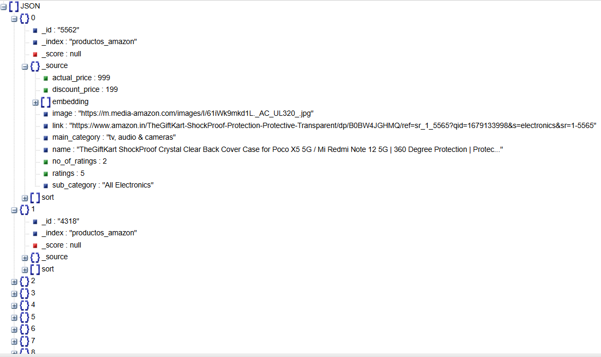
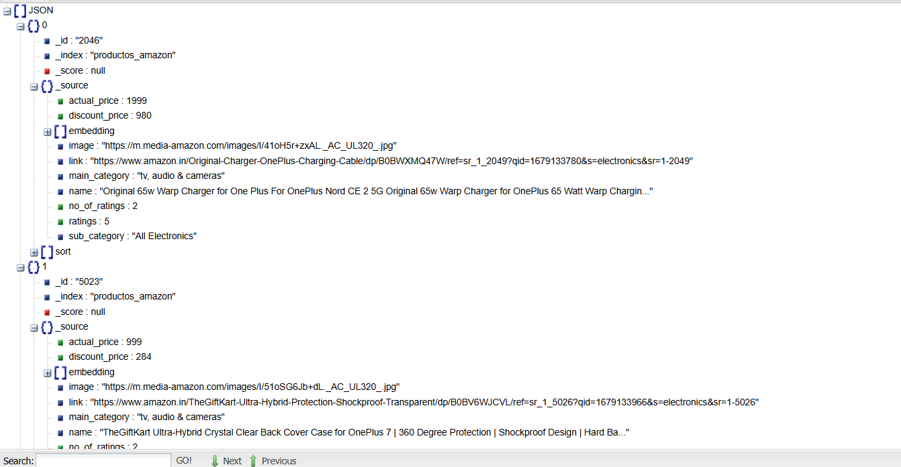
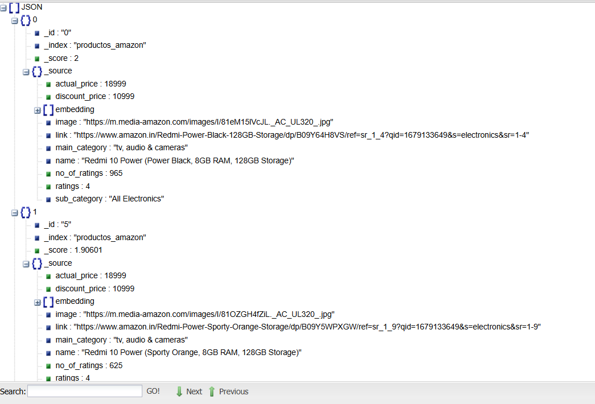
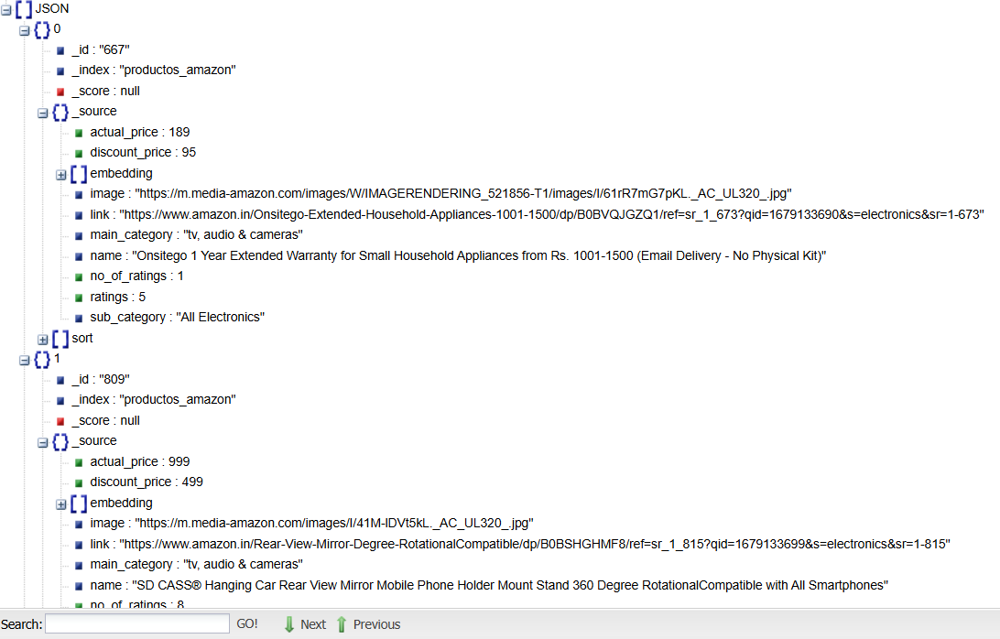
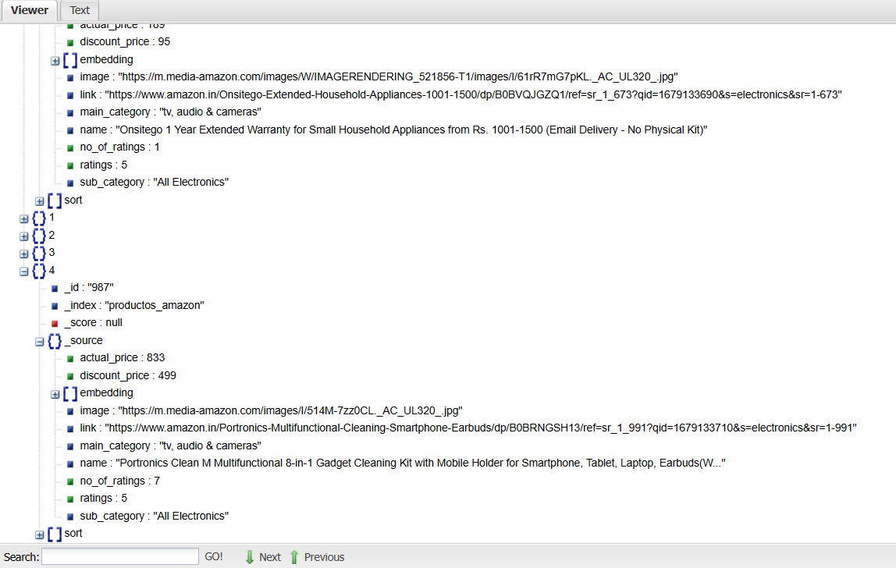

# Proyecto Elasticsearch - Evaluación de Conocimientos

## 1. Objetivo

Este proyecto evalúa el manejo de Elasticsearch, incluyendo:
- Creación de índices con mappings adecuados.
- Ingesta de datos desde un CSV (dataset de productos de Amazon).
- Implementación de plantillas Mustache para búsquedas avanzadas.
- Generación y actualización de embeddings (para búsquedas semánticas) utilizando un modelo preentrenado.
- Desarrollo de una API en Flask con múltiples endpoints:
  - **/search**: Realiza búsquedas utilizando una plantilla Mustache.
  - **/similar_products**: Devuelve el top 5 de productos similares basados en embeddings.
  - **/top_products**: Lista los productos mejor valorados (con opción de filtrar por categoría).

---

## 2. Datos de Origen

El dataset se descarga desde:
[https://www.kaggle.com/datasets/lokeshparab/amazon-products-dataset?select=All+Electronics.csv](https://www.kaggle.com/datasets/lokeshparab/amazon-products-dataset?select=All+Electronics.csv)

**Campos del Dataset:**
- **name**: Nombre del producto
- **main_category**: Categoría principal
- **sub_category**: Subcategoría
- **image**: URL de la imagen del producto
- **link**: Enlace al producto
- **ratings**: Calificación del producto
- **no_of_ratings**: Número de valoraciones
- **discount_price**: Precio con descuento
- **actual_price**: Precio original

---

## 3. Estructura del Proyecto

- **app.py**  
  API en Flask con los endpoints `/search`, `/similar_products` y `/top_products`.

- **es_index.py**  
  Script para crear el índice y el mapping en Elasticsearch.

- **ingest_data.py**  
  Script para cargar el CSV en Elasticsearch (con limpieza robusta de datos).

- **update_embeddings.py**  
  Script para generar y actualizar embeddings (usando el modelo `all-mpnet-base-v2`).

- **requirements.txt**  
  Dependencias del proyecto.

- **README.md**  
  Este archivo de documentación.

- **docker-compose.yml**  
  Configuración de Docker para levantar Elasticsearch.

- **templates/**  
  - **search_template.json**: Template Mustache para búsquedas.

- **data/**  
  - **All_Electronics.csv**: Archivo CSV del dataset.

---

## 4. Pasos de Ejecución

### 4.1 Levantar Elasticsearch con Docker

Utiliza Docker Compose para levantar el clúster:

```bash
docker-compose up -d 
```

### 4.2 Crear el Índice en Elasticsearch

Ejecuta el script para crear el índice:

```bash
python es_index.py
```
Este script eliminará el índice si ya existe y lo creará nuevamente con el mapping adecuado, incluyendo el campo `embedding` de 768 dimensiones.

### 4.3 Ingesta de Datos
Carga el catálogo de productos desde el CSV en Elasticsearch:

```bash
python ingest_data.py
```
El script realiza la limpieza de campos como precios, número de ratings, etc.

### 4.4 Actualización de Embeddings
Utiliza el modelo all-mpnet-base-v2 para generar y actualizar los embeddings a partir del campo `name`:

```bash
python update_embeddings.py
```
El script muestra mensajes de depuración cada cierto número de documentos procesados y, al final, indica el total de documentos actualizados.

### 4.5 Levantar la API
Inicia la API en Flask:

```bash
python app.py
```
La API se ejecutará en `http://127.0.0.1:5000`.

## 5. Endpoints y Ejemplos de Uso

### 5.1 /search (Con Template Mustache)
Realiza búsquedas utilizando el template Mustache.
- **Ejemplo 1:** Buscar productos que contengan `"Redmi"` y que tengan la categoría exacta `"tv, audio & cameras"`:
```bash
http://127.0.0.1:5000/search?search_box=Redmi&main_category=tv,%20audio%20%26%20cameras
```



- **Ejemplo 2:** Buscar productos que contengan `"OnePlus"` (sin filtrar por categoría):
```bash
http://127.0.0.1:5000/search?search_box=OnePlus
```


### 5.2 /similar_products
Calcula el embedding del producto consultado y devuelve el Top 5 de productos más similares (usando `cosineSimilarity`).
- **Ejemplo:** Buscar productos similares a
` "Redmi 10 Power (Power Black, 8GB RAM, 128GB Storage)" `
(Recuerda codificar correctamente espacios y caracteres especiales)
```bash
http://127.0.0.1:5000/similar_products?product_name=Redmi%2010%20Power%20(Power%20Black,%208GB%20RAM,%20128GB%20Storage)
```

### 5.3 /top_products
Devuelve los productos mejor valorados, con opción de filtrar por categoría y definir un límite de resultados.
- **Ejemplo 1:** Los 10 productos mejor valorados (sin filtro de categoría):
```bash
http://127.0.0.1:5000/top_products
```

- **Ejemplo 2:** Los 5 productos mejor valorados de la categoría "tv, audio & cameras":
```bash
http://127.0.0.1:5000/top_products?limit=5&main_category=tv,%20audio%20%26%20cameras
```


